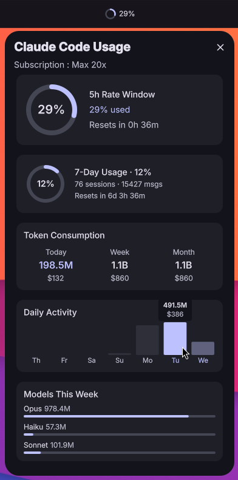

# Claude Code Usage

A [DMS (Dank Material Shell)](https://github.com/AvengeMedia/DankMaterialShell) plugin that monitors your Claude Code subscription usage directly from the taskbar.



## Features

- **Taskbar pill** with circular progress ring showing 5-hour rate limit utilization
- **Detailed popout** with:
  - 5-hour and 7-day rate window utilization with countdown timers
  - Token consumption breakdown (today, week, month)
  - 7-day daily activity bar chart
  - Per-model token usage for the current week
  - All-time session and message statistics
- **Automatic subscription detection** via the Anthropic OAuth API
- **Configurable refresh interval** (30s to 5min)
- **Localization support** (English and French)

## Requirements

- [DMS Shell](https://github.com/AvengeMedia/DankMaterialShell)
- [jq](https://jqlang.github.io/jq/) (JSON processor)
- An active [Claude Code](https://docs.anthropic.com/en/docs/claude-code) installation with OAuth credentials

## Installation

### From the DMS Plugin Registry

```
dms plugins install claudeCodeUsage
```

Or browse the plugin list in DMS Settings (`Mod + ,` > Plugins).

### Manual

Clone this repository into your DMS plugins directory:

```bash
git clone https://github.com/titeya/dms-claudecode \
  ~/.config/DankMaterialShell/plugins/claudeCodeUsage
```

Then restart DMS.

## Configuration

Open DMS Settings (`Mod + ,` > Plugins > Claude Code Usage) to adjust the refresh interval.

## How It Works

The plugin runs a lightweight bash script at the configured interval that:

1. Reads your OAuth token from `~/.claude/.credentials.json`
2. Queries the Anthropic usage API for current rate limit status
3. Parses local JSONL session files for token consumption statistics

All data stays local. The only network request is to the official Anthropic API using your existing OAuth credentials.

## License

[MIT](LICENSE)
