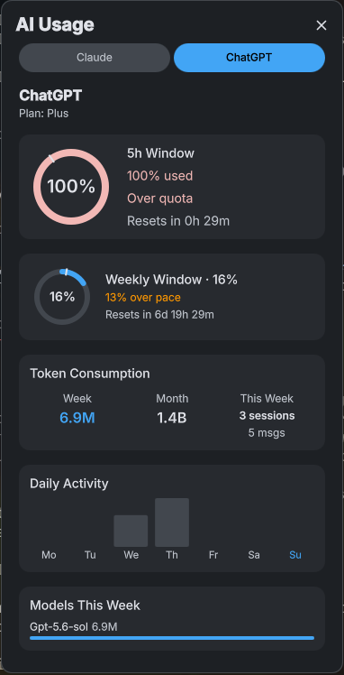

# Claude Code Usage

A [DMS (Dank Material Shell)](https://github.com/AvengeMedia/DankMaterialShell) plugin that monitors your Claude Code subscription usage directly from the taskbar.



## Features

- **Taskbar pill** with circular progress ring showing 5-hour rate limit utilization
- **Detailed popout** with:
  - 5-hour and 7-day rate window utilization with countdown timers
  - Stale-data warning when the usage API cannot be reached — the pill dims and adds `?`, and the popout says how old the numbers are and what to do about it (e.g. `3h 40m old · Claude Code login expired - run claude once`), instead of presenting cached numbers as live
  - Refresh button in the popout header for an immediate fetch that ignores the cache — after fixing an expired login you see the real numbers straight away instead of waiting out the refresh interval
  - Pacing indicator showing whether you're over or under a linear burn rate for each window (e.g. "6% over pace", "25% under pace")
  - Per-model weekly limits under the 7-day ring — claude.ai gives some models their own weekly cap, so the all-models ring can sit at 71% while a single model is at 6%
  - Token consumption breakdown (today, the current rate limit week, calendar month). The week totals cover the seven days the 7-day ring measures, which start when the limit last reset, not Monday - the card says which day they start from
  - Estimated API cost per period (today, week, calendar month) with automatic pricing from [LiteLLM](https://github.com/BerriAI/litellm)
  - Daily activity bar chart covering the same seven days as the 7-day ring, so the bars add up to the week total above them. It starts on the day the limit last reset, so the weekday labels rotate with the window and each tooltip names its date (token count + cost)
  - Per-model token usage for the current rate limit week with dynamic model family detection
  - All-time session and message statistics
- **Profile breakdown** — per-profile token/cost stats with a hybrid profile selector (tabs for up to 4 profiles, dropdown for more). Profiles are discovered automatically from:
  - `~/.claude` (the `default` profile)
  - [CCS](https://github.com/kaitranntt/ccs) instances in `~/.ccs/instances/`
  - [claude-code-profiles](https://github.com/felipeadeildo/claude-code-profiles) profiles in `~/.ccp/profiles/*.env` (the `CLAUDE_CONFIG_DIR` declared in each `.env` is used)
  - Any directory you add manually under **Custom Profiles** in the plugin settings
  - Profile overlay on the daily activity chart: grey bars show total usage, colored bars show the selected profile's share
  - Tooltip shows both total and per-profile token counts when a profile is selected
- **Counts every client on the subscription** — an agent harness that reaches Anthropic through a bridge (e.g. [CLIProxyAPI](https://github.com/router-for-me/CLIProxyAPI)) spends the same rate limit budget while writing its transcripts elsewhere, so those Claude calls are counted too. Without it a day spent in such a client reads as "today: 0 tokens" under a 5-hour ring that says 16% used. Currently detects [pi](https://github.com/badlogic/pi-mono) transcripts (`~/.pi/agent/sessions/`, `~/.pi/profiles/*/sessions/`, or `$PI_CONFIG_DIR`); only Claude models are counted, and can be turned off in the settings
- **Automatic subscription detection** via the Anthropic OAuth API
- **Automatic token renewal** — the ~12h OAuth access token is refreshed with the stored refresh token when it expires, so the widget keeps working through the days you never launch Claude Code
- **Dynamic model pricing** — new Anthropic model families are detected automatically, no code changes needed
- **Currency support** — costs displayed in EUR for French locale, USD otherwise (exchange rate from ECB via [Frankfurter](https://www.frankfurter.app/))
- **Configurable refresh interval** (2 to 15 minutes)
- **Localization support** (English and French)

## Requirements

- [DMS Shell](https://github.com/AvengeMedia/DankMaterialShell)
- [jq](https://jqlang.github.io/jq/) (JSON processor)
- An active [Claude Code](https://docs.anthropic.com/en/docs/claude-code) installation with OAuth credentials

## Installation

### From the DMS Plugin Registry

```
dms plugins install claudeCodeUsage
```

Or browse the plugin list in DMS Settings (`Mod + ,` > Plugins).

### Manual

Clone this repository into your DMS plugins directory:

```bash
git clone https://github.com/titeya/dms-claudecode \
  ~/.config/DankMaterialShell/plugins/claudeCodeUsage
```

Then restart DMS.

## Configuration

Open DMS Settings (`Mod + ,` > Plugins > Claude Code Usage) to adjust the refresh interval,
toggle pacing indicators, toggle counting of other clients on the subscription, and
register custom profiles.

### Custom Profiles

If you use a profile manager the plugin doesn't detect automatically, add it under
**Custom Profiles** with a name and a config directory path:

| Name | Config directory |
|------|------------------|
| `work` | `~/.ccp/data/work` |

The path is a `CLAUDE_CONFIG_DIR` — the folder that contains `projects/`, i.e. whatever
`~/.claude` is for the default profile. The plugin reads usage from `<path>/projects/`
and, when present, `<path>/.credentials.json` so rate limits are tracked per profile too.

Entries whose `projects/` folder doesn't exist are ignored, and a name already claimed by
an auto-detected profile is skipped.

## How It Works

The plugin runs a lightweight bash script at the configured interval that:

1. Reads your OAuth token from `~/.claude/.credentials.json`, and renews it with the stored refresh token when it has expired (the same `refresh_token` grant Claude Code itself uses)
2. Queries the Anthropic usage API for current rate limit status
3. Scans `<config dir>/projects/` for every discovered profile (see above) for token consumption statistics — each profile is processed in parallel
4. Scans the transcripts of other clients on the same subscription (pi sessions, unless **Count other clients** is off) and attributes their Claude calls to the `default` profile, since they bill the login whose rate limits the popout shows. Where such a transcript records its own cost, that cost is used — it prices the exact model that answered, including ones LiteLLM has never heard of
5. Fetches model pricing from LiteLLM and USD/EUR exchange rate from ECB (cached daily in `~/.claude/pricing-cache.json`)

API usage responses are cached for 90 seconds (`~/.claude/usage-cache.json`) to avoid rate limiting; the popout refresh button skips that cache. If a fetch fails the cached numbers are still shown, but they are labelled with their age and the reason the fetch failed — a login that not even the refresh token can save (run `claude` once), a rate limit, or no connection.

All data stays local. Network requests are limited to the official Anthropic API (usage), the Claude OAuth token endpoint (only when the access token has to be renewed), GitHub (LiteLLM pricing, once/day), and Frankfurter (exchange rate, once/day).

## License

[MIT](LICENSE)
